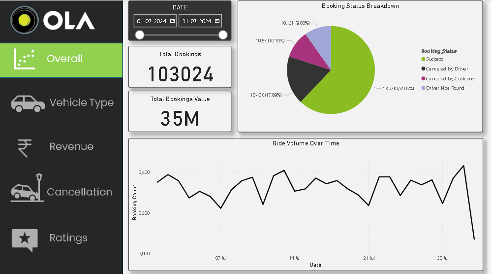
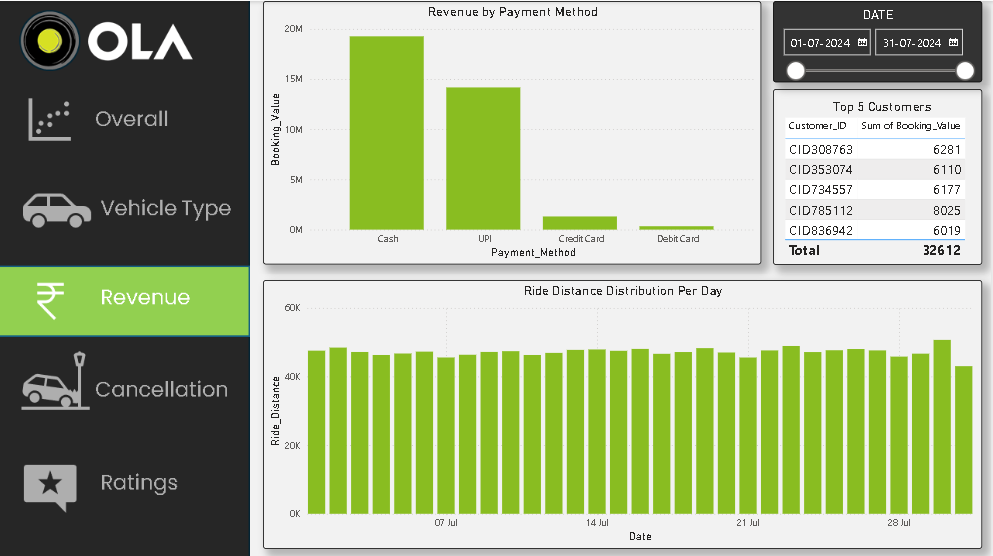
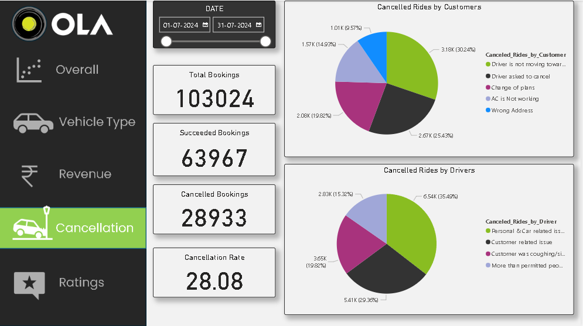
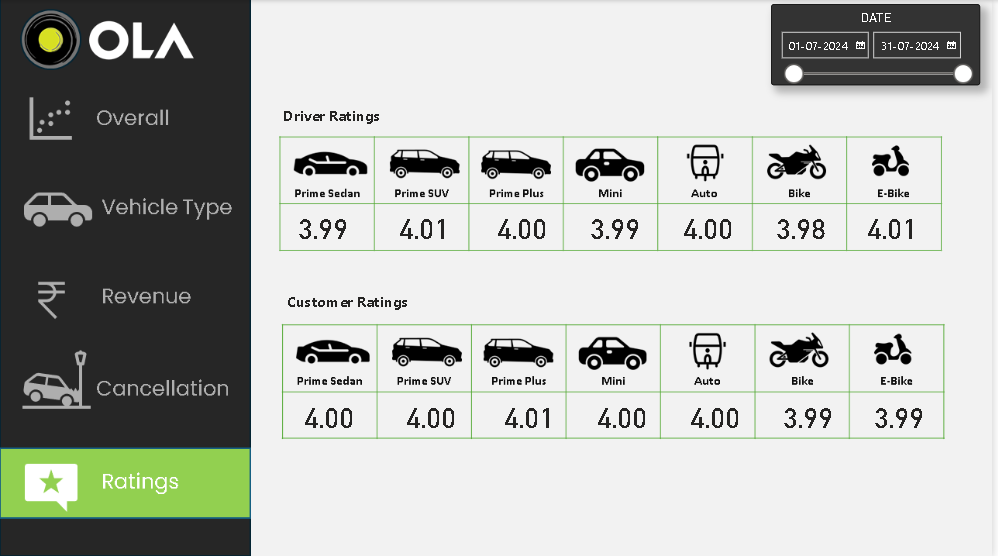

### OLA Dashboard - Power BI Analytics

A comprehensive data analytics dashboard built with Microsoft Power BI for business intelligence and data visualization.

---

### Project Overview

The OLA Dashboard is a Power BI solution designed to transform raw data into meaningful insights through interactive visualizations. This project enables stakeholders to monitor KPIs, identify trends, and make data-driven decisions.

---

### Dashboard Preview

Below is a snapshot of the PowerBI dashboard:

)

---

### Key Features

1.Interactive Visualizations: Charts, graphs, and tables that respond to user interactions

2.Real-time Data Refresh: Connect to live data sources or scheduled refreshes

3.Multi-page Reports: Organized by business function (Sales, Marketing, Operations)

4.Drill-through Capabilities: Navigate from high-level metrics to detailed analysis

5.Mobile Responsive: Adapts to different screen sizes

---

## Key Insights and Analysis

### SQL Analysis
1. **Successful Bookings**: Identified all completed rides.
2. **Average Ride Distance**: Calculated for each vehicle type to understand efficiency.
3. **Cancellation Insights**:
   - Total canceled rides (customer and driver).
   - Reasons for driver cancellations (personal, car issues, etc.).
4. **Top Customers**: Ranked by number of bookings and total spending.
5. **Revenue Trends**: Summarized booking values for successful rides.
6. **Ratings Distribution**: Analyzed by vehicle type for customer and driver performance.

### Power BI Dashboards
1. **Ride Volume Over Time**: Trends in ride bookings across days and weeks.
2. **Booking Status Breakdown**: Pie charts illustrating success, cancellations, and incomplete rides.
3. **Revenue Breakdown**: Bar charts by payment method and customer value.
4. **Cancellation Reasons**: Segmented by customers and drivers for actionable insights.
5. **Rating Comparisons**: Driver and customer ratings are compared across various vehicle types using card visuals.

---

## How to Use the Repository

1. **Clone or Download**:
   - Clone this repository using Git or download it as a ZIP file.

2. **SQL Queries**:
   - Load the `Bookings-100000-Rows.xlsx` dataset into your database (e.g., MySQL, PostgreSQL).
   - Run the queries in `Ola_Data_Analysis.sql` to generate insights.

3. **Power BI Dashboard**:
   - Open `Ola_Data_Visualization.pbix` in Power BI Desktop.
   - Explore the dashboards and interact with filters for detailed insights.

4. **Showcase**:
   - Include the Power BI file to demonstrate interactive dashboarding skills.

---

## Tools and Technologies Used
- **SQL**: For querying and extracting insights from the dataset.
- **Excel**: To handle large datasets and initial data exploration.
- **Power BI**: For creating interactive dashboards and visual storytelling.

---
